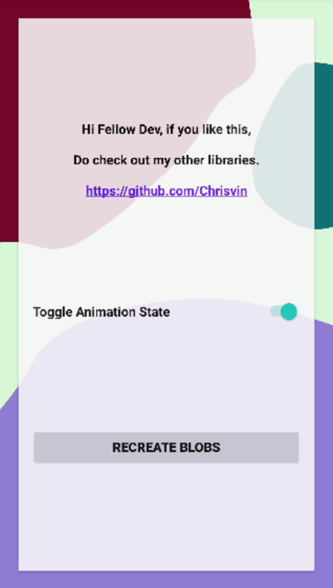

# BlobBackgroundLayout
Android Layout Library with animated Blob Background

[](https://opensource.org/licenses/MIT) [](https://jitpack.io/#Chrisvin/BlobBackgroundLayout) [](https://android-arsenal.com/api?level=21)



## Demo app
To run the demo project, clone the repository and run it via Android Studio.
</br>(OR)
</br>Download the latest demo apk from [releases](https://github.com/Chrisvin/BlobBackgroundLayout/releases).

## Usage
#### Set up the dependency
1. Add the JitPack repository to your root build.gradle at the end of repositories:
```
allprojects {
	repositories {
		...
		maven { url 'https://jitpack.io' }
	}
}
```
2. Add the BlobBackgroundLayout dependency in the build.gradle:
```
implementation 'com.github.Chrisvin:BlobBackgroundLayout:1.1'
```

#### Use a `BlobLayout` as the base container in your activity/fragments.
```
<?xml version="1.0" encoding="utf-8"?>
<com.jem.blobbackground.layout.BlobConstraintLayout
    xmlns:android="http://schemas.android.com/apk/res/android"
    xmlns:app="http://schemas.android.com/apk/res-auto"
    xmlns:tools="http://schemas.android.com/tools"
    android:id="@+id/blobLayout"
    android:layout_width="match_parent"
    android:layout_height="match_parent"
    tools:context=".MainActivity">

    <!--  Fill with your views, just like you would in a normal ConstraintLayout  -->
    
</com.jem.blobbackground.layout.BlobConstraintLayout>

<!--  Also supports BlobFrameLayout & BlobLinearLayout  -->
```

#### Add blobs in the `BlobLayout` using `addBlob()`
The individual blobs can be customized in `Blob.Configuration`.
```
blobLayout.addBlob(
    Blob.Configuration(
        // Position of the Blobs center point
        blobCenterPosition = newBlobCenterPosition,  // Optional, Default = PointF(0f, 0f)
        
        // The number of curve points in the blob
        pointCount = newPointCount, // Optional, Default = 16
        
        // The radius of the blob
        radius = newRadius, // Optional, Default = 750f
        
        // The maximum offset from the radius of the blob
        maxOffset = newMaxOffset,   // Optional, Default = 100f
        
        // Should the blob animate/change shape over time
        shouldAnimateShape = newShouldAnimateShape, // Optional, Default = true
        
        // Time taken for blob to fully change from one shape to another
        shapeAnimationDuration = newShapeAnimationDuration, // Optional, Default = 2000L
        
        // The interpolator used for shape animation
        shapeAnimationInterpolator = newShapeAnimationInterpolator, // Optional, Default = LinearInterpolator()
        
        // The paint used to draw the blob, can be used to set color, draw only outline, etc.
        paint = newPaint   
        /* Optional, Default = Paint().apply {
               isAntiAlias = true
               style = Paint.Style.FILL
               color = Color.RED
           }
        */
    )
)
```

### And you're done with your awesome blobby UI, easy-peasy. ^_^

## Additional functionalities
#### Get blob count
```
val blobCount: Int = blobLayout.getBlobCount()
```
#### Recreate all blobs with new shapes
```
blobLayout.recreateBlobs()
```
#### Recreate blob at index with new shape
```
blobLayout.recreateBlob(index)
```
#### Remove all blobs
```
blobLayout.removeBlobs()
```
#### Remove blob at index
```
blobLayout.removeBlob(index)
```
#### Get all blob configurations
```
val blobConfigs: Array<Blob.Configuration> = blobLayout.getBlobConfigurations()
```
#### Get configuration for blob at index
```
val blobConfig: Blob.Configuration = blobLayout.getBlobConfiguration(index)
```
#### Update all blob configurations
```
blobLayout.updateBlobConfigurations(blobConfigs)
```
#### Update configuration for blob at index
```
blobLayout.updateBlobConfiguration(blobConfig, index)
```

Note: Aforementioned functionalities are supported in all BlobLayouts (`BlobConstraintLayout`,`BlobFrameLayout`,`BlobLinearLayout`)

## Bugs and Feedback
For bugs, questions and discussions please use the [Github Issues](https://github.com/Chrisvin/BlobBackgroundLayout/issues).

## License
```
MIT License

Copyright (c) 2019 Jem

Permission is hereby granted, free of charge, to any person obtaining a copy
of this software and associated documentation files (the "Software"), to deal
in the Software without restriction, including without limitation the rights
to use, copy, modify, merge, publish, distribute, sublicense, and/or sell
copies of the Software, and to permit persons to whom the Software is
furnished to do so, subject to the following conditions:

The above copyright notice and this permission notice shall be included in all
copies or substantial portions of the Software.

THE SOFTWARE IS PROVIDED "AS IS", WITHOUT WARRANTY OF ANY KIND, EXPRESS OR
IMPLIED, INCLUDING BUT NOT LIMITED TO THE WARRANTIES OF MERCHANTABILITY,
FITNESS FOR A PARTICULAR PURPOSE AND NONINFRINGEMENT. IN NO EVENT SHALL THE
AUTHORS OR COPYRIGHT HOLDERS BE LIABLE FOR ANY CLAIM, DAMAGES OR OTHER
LIABILITY, WHETHER IN AN ACTION OF CONTRACT, TORT OR OTHERWISE, ARISING FROM,
OUT OF OR IN CONNECTION WITH THE SOFTWARE OR THE USE OR OTHER DEALINGS IN THE
SOFTWARE.
```
